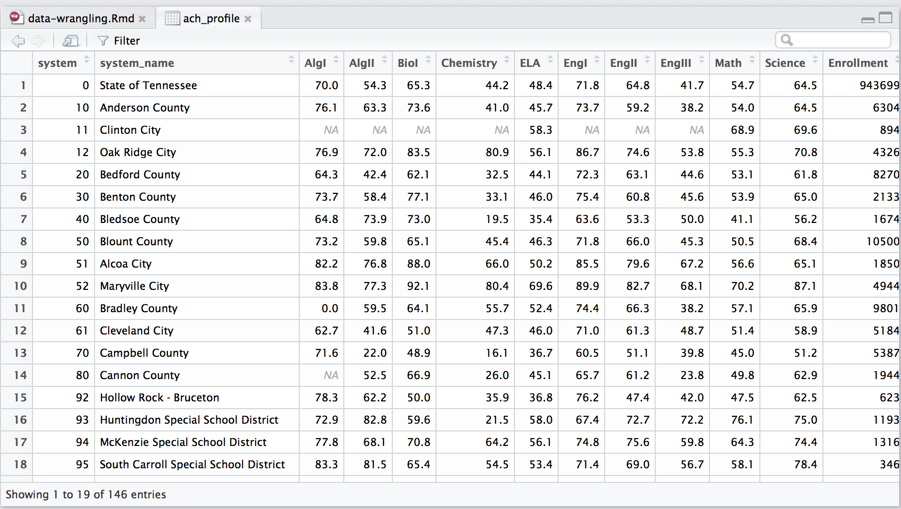
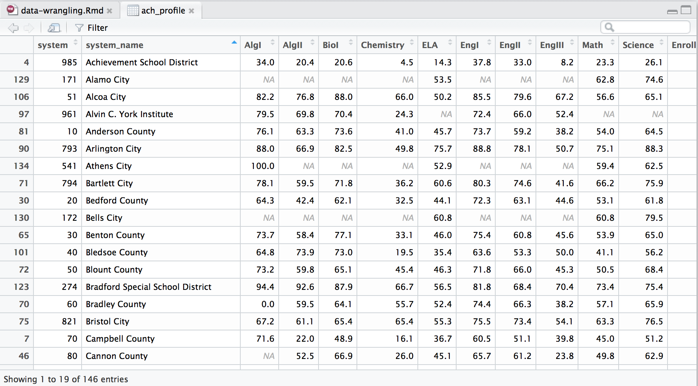
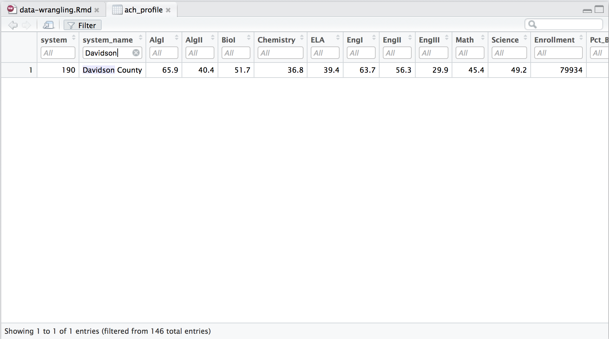
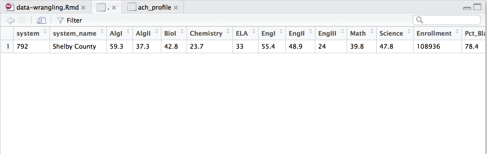
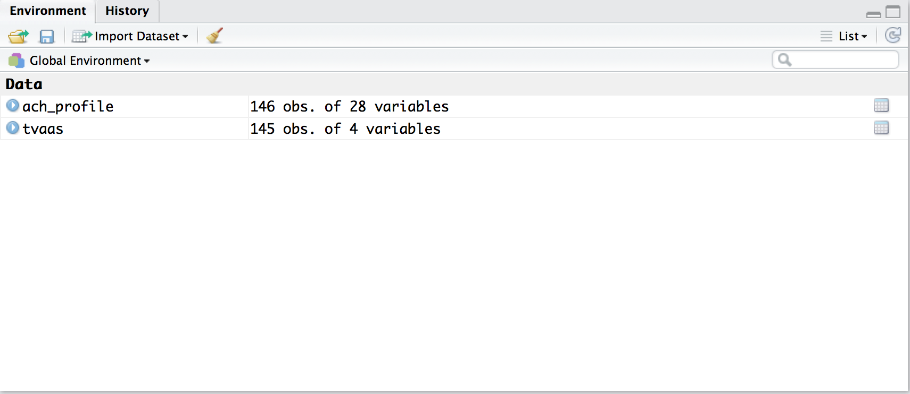
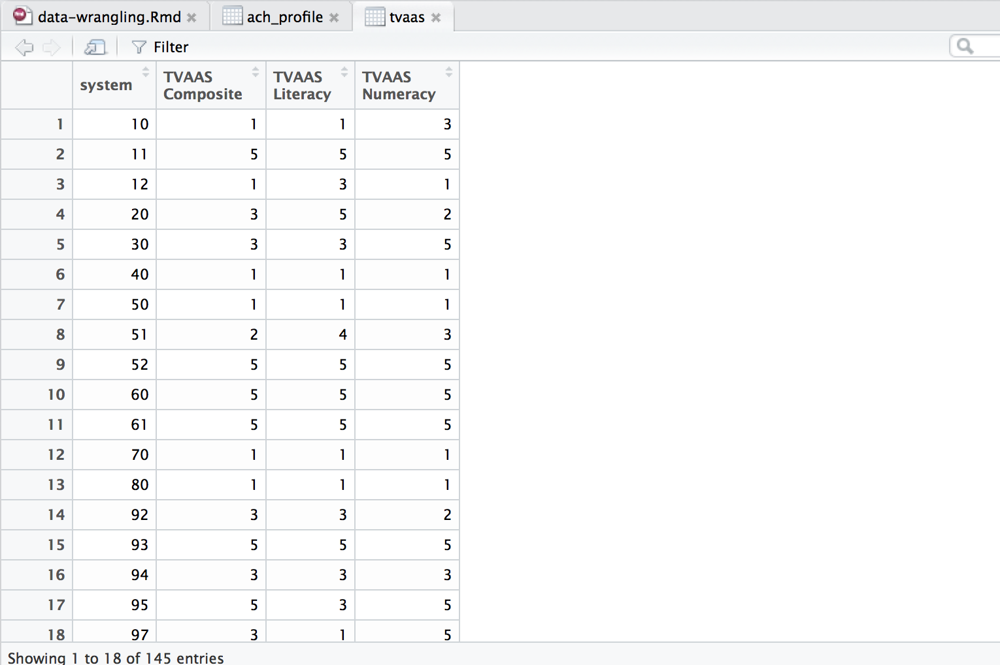
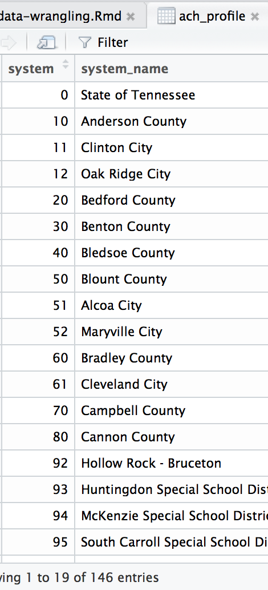

``` {r setup, include = FALSE}
knitr::opts_chunk$set(echo = TRUE, message = FALSE, warning = FALSE)
options(width = 65)

library(tidyverse)
```

## Table of contents

* [Looking at a data frame](#/looking-at-data)
* [Keeping/dropping variables](#/keepingdropping-variables)
* [Reordering variables](#/reordering-variables)
* [Keeping/dropping observations](#/keepingdropping-observations)
* [Creating/modifying variables](#/creating-new-variables)
* [Creating/modifying variables conditionally](#/if_else-with-mutate)
* [The pipe operator](#/the-pipe-operator)
* [Renaming variables](#/renaming-variables)
* [Sorting](#/sorting-a-data-frame)
* [Creating a data frame of summary statistics](#/collapsing-a-data-frame)
* [Aggregating data by group](#/collapsing-a-data-frame-2)
* [Add summary statistics to a data frame](#/add-summary-statistics-to-a-data-frame)
* [Operations by row](#/operations-by-row)
* [Combining data frames](#/combining-data-frames)
* [Reshaping](#/reshaping-data-frames)

## The `tidyverse`

The `tidyverse` is a set of packages which covers most steps of the data science process (importing, wrangling, visualization).


> * Built around the concept of a **tidy** data frame
> * Work nicely with the **pipe** `%>%`

## Obtaining the `tidyverse`

Install the `tidyverse` packages and their dependencies:

`install.packages("tidyverse")`  

&nbsp;

. . .

Import the core `tidyverse` packages into your R session:

`library(tidyverse)`

## Reading in data

Use `readr::read_csv()` to import a .csv file:

``` {r}
ach_profile <- read_csv("data/achievement_profile_data_with_CORE.csv")
```

## Our data

For each of 145 TN school districts and the State, the `ach_profile` data contains:

* Proficiency rates on state tests
* Student demographics
* Chronic absenteeism
* Discipline (suspension, expulsion) rates
* High school graduation, dropout rates
* Average ACT composite scores
* A region variable

for the 2014-15 school year.

## Looking at data

Use `View()` to look at a data frame:

``` {r, eval = FALSE}
View(ach_profile)
```



## Looking at data

The RStudio viewer has features for sorting and filtering:



## Looking at data

The RStudio viewer has features for sorting and filtering:



## An overview of a data frame

Use `summary()` to get an overview of a data frame:

```{r, eval = FALSE}
summary(ach_profile)
```

. . .

```{r, echo = FALSE}
summary(ach_profile)
```

## An overview of a data frame

Use `tibble::glimpse()` to get an overview of a data frame:

```{r}
glimpse(ach_profile)
```

## `dplyr` and `tidyr`

Your two-stop shop for data wrangling:

. . .

 

`dplyr`: pliers, for data frames

## `dplyr`

Five main functions:

* `select()`
* `filter()`
* `mutate()`
* `arrange()`
* `summarise()`

## Keeping/dropping variables

Keep variables with `select()`:

``` {r, eval = FALSE}
select(ach_profile, system, system_name)
```

. . .

The first argument to `select()` is a data frame, and the second is the variable(s) you want to keep, separated by commas.

## Keeping/dropping variables

Keep variables with `select()`:

``` {r}
select(ach_profile, system, system_name)
```

## Keeping/dropping variables

Drop variables with `select()` using `-` before a variable name:

``` {r}
select(ach_profile, -system)
```

## Ways to call variables with `select`

> * Unquoted names - `select(df, x, y, z)`
> * A range of variables positionally - `select(df, x:z)`

. . .

* Using `dplyr` helper functions, including:
    * `starts_with()`
    * `ends_with()`
    * `contains()`
    * `one_of()` if you need to specify variables as a string
    * `everything()`

## Reordering variables

Reorder variables with `select()` by listing variables in the order you want:

``` {r, eval = FALSE}
select(ach_profile, system, system_name, CORE_region, everything())
```

. . .

``` {r, echo = FALSE}
select(ach_profile, system, system_name, CORE_region, everything())
```

## Keeping/dropping observations

Keep observations with `filter()`:

``` {r, eval = FALSE}
filter(ach_profile, system_name == "State of Tennessee")
```

. . .

The first argument to `filter()` is a data frame, and the second is a logical condition describing the observations you want to keep.

## Keeping/dropping observations

Keep observations with `filter()`:

``` {r}
filter(ach_profile, system_name == "State of Tennessee")
```

## Keeping/dropping observations

Drop observations with `filter()` using `!` before a logical condition:

``` {r}
filter(ach_profile, !system_name == "State of Tennessee")
```

## Exercise 1

Use `filter()` to identify districts with 100% Algebra I proficiency.

. . .

``` {r, eval = FALSE}
filter(ach_profile, AlgI == 100)
```

. . .

``` {r, echo = FALSE}
filter(ach_profile, AlgI == 100)
```

## Creating new variables

Create new variables with `mutate()`:

``` {r, eval = FALSE}
mutate(ach_profile, 
    Pct_BHN = Pct_Black + Pct_Hispanic + Pct_Native_American)
```

. . .

The first argument to `mutate()` is a data frame, and the second is a new variable name followed by `=` and an expression for calculating that variable.

## Modifying variables

The syntax for modifying variables with `mutate()` is the same as for creating variables:

``` {r, eval = FALSE}
mutate(ach_profile, Enrollment = Enrollment/1000)
```

## Creating/modifying variables

Create and/or modify arbitrarily many variables with `mutate()`; separate expressions with a comma:

``` {r, eval = FALSE}
mutate(ach_profile, Enrollment = Enrollment/1000,
    Per_Pupil_Expenditures = Per_Pupil_Expenditures/1000)
```

## `if_else()` with `mutate()`

Use `if_else()` if you want a variable to take different values under different conditions:

``` {r, eval = FALSE}
mutate(ach_profile,
    district_size = if_else(Enrollment >= 10000, "Large", "Small"))
```

&nbsp;

> * The first argument to `if_else()` is a logical condition.
> * The second is the value of the new variable if the logical condition is `TRUE`.
> * The third is the value of the variable if the logical condition is `FALSE`.
> * If the logical condition returns `NA`, the value of the variable will be `NA`.

## `if_else()` with `mutate()`

Use `if_else()` if you want a variable to take different values under different conditions:

``` {r, eval = FALSE}
mutate(ach_profile,
    district_size = if_else(Enrollment >= 10000, "Large", "Small"))
```

``` {r, echo = FALSE}
ach_profile %>% 
    mutate(district_size = if_else(Enrollment >= 10000, "Large", "Small")) %>%
    select(system_name, Enrollment, district_size)
```

## `if_else()` with `mutate()`

Use multiple `if_else()` statements in succession if you have multiple conditions:

``` {r, eval = FALSE}
mutate(ach_profile,
    district_size = if_else(Enrollment >= 10000, "Large", NA_character_),
    district_size = if_else(Enrollment >= 5000 & Enrollment < 10000, 
        "Medium", district_size),
    district_size = if_else(Enrollment < 5000, "Small", district_size)
)
```

. . .

The first `if_else()` assigns a value of `"Large"` to `district_size` if `Enrollment` is greater or equal to 10000, and `NA` (of the character variety) otherwise.

## `if_else()` with `mutate()`

Use multiple `if_else()` statements in succession if you have multiple conditions:

``` {r, eval = FALSE}
mutate(ach_profile,
    district_size = if_else(Enrollment >= 10000, "Large", NA_character_),
    district_size = if_else(Enrollment >= 5000 & Enrollment < 10000, 
        "Medium", district_size),
    district_size = if_else(Enrollment < 5000, "Small", district_size)
)
```

The second `if_else()` assigns a value of `"Medium"` to `district_size` if `Enrollment` is between 5000 and 10000, and leaves `district_size` the same otherwise.

## `if_else()` with `mutate()`

Use multiple `if_else()` statements in succession if you have multiple conditions:

``` {r, eval = FALSE}
mutate(ach_profile,
    district_size = if_else(Enrollment >= 10000, "Large", NA_character_),
    district_size = if_else(Enrollment >= 5000 & Enrollment < 10000,
        "Medium", district_size),
    district_size = if_else(Enrollment < 5000, "Small", district_size)
)
```

The third `if_else()` assigns a value of `"Small"` to `district_size` if `Enrollment` is less than 5000, and leaves `district_size` the same otherwise.

## `if_else()` with `mutate()`

``` {r, eval = FALSE}
mutate(ach_profile,
    district_size = if_else(Enrollment >= 10000, "Large", NA_character_),
    district_size = if_else(Enrollment >= 5000 & Enrollment < 10000,
        "Medium", district_size),
    district_size = if_else(Enrollment < 5000, "Small", district_size)
)
```

``` {r, echo = FALSE}
mutate(ach_profile,
    district_size = if_else(Enrollment >= 10000, "Large", NA_character_),
    district_size = if_else(Enrollment >= 5000 & Enrollment < 10000,
        "Medium", district_size),
    district_size = if_else(Enrollment < 5000, "Small", district_size)
) %>%
    select(system_name, Enrollment, district_size)
```

## `case_when()` with `mutate()`

With many conditions, it's better to use `case_when` than several `if_else` statements:

```{r, eval = FALSE}
mutate(ach_profile,
    district_size = case_when(
        Enrollment >= 10000 ~ "Large",
        Enrollment >= 5000 & Enrollment < 10000 ~ "Medium",
        Enrollment < 5000 ~ "Small"
    )
)
```

. . .

The argument to `case_when()` is a sequence of two-sided formulas, where the left side of each formula is a logical condition, and the right side is the value of a variable if the logical condition is `TRUE`.

## Exercise 2

Create a new variable called `math_achievement` with a value of:
    
* `"High"` if a district's Math proficiency is 75% or higher;
* `"Medium"` if a district's Math proficiency is between 50% and 75%;
* `"Low"` if a district's Math proficiency is below 50%.

&nbsp;

. . .

``` {r, eval = FALSE}
mutate(ach_profile,
    math_achievement = if_else(Math >= 75, "High", NA_character_),
    math_achievement = if_else(Math >= 50 & Math < 75, "Medium", math_achievement),
    math_achievement = if_else(Math < 50, "Low", math_achievement)
)
```

## Exercise 2

Create a new variable called `math_achievement` with a value of:
    
* `"High"` if a district's Math proficiency is 75% or higher;
* `"Medium"` if a district's Math proficiency is between 50% and 75%;
* `"Low"` if a district's Math proficiency is below 50%.

&nbsp;

``` {r, eval = FALSE}
mutate(ach_profile, 
    math_achievement = case_when(
        Math >= 75 ~ "High",
        Math >= 50 & Math < 75 ~ "Medium",
        Math < 50 ~ "Low"
    )
)
```

## Exercise 2

Create a new variable called `math_achievement` with a value of:
    
* `"High"` if a district's Math proficiency is 75% or higher;
* `"Medium"` if a district's Math proficiency is between 50% and 75%;
* `"Low"` if a district's Math proficiency is below 50%.

``` {r, echo = FALSE}
mutate(ach_profile,
    math_achievement = if_else(Math >= 75, "High", NA_character_),
    math_achievement = if_else(Math >= 50 & Math < 75, "Medium", math_achievement),
    math_achievement = if_else(Math < 50, "Low", math_achievement)
) %>%
select(system_name, Math, math_achievement)
```

## The pipe operator (`%>%`)

Often, you will want to do several data manipulations in succession. This can be a hassle if you have to nest a bunch of function calls:

``` {r, eval = FALSE}
mutate(
    select(
        filter(ach_profile, system_name != "State of Tennessee"),
    system_name, Enrollment:Per_Pupil_Expenditures),
Enrollment = log10(Enrollment)
)
```

. . .

Or assign each intermediate step to a object:

``` {r, eval = FALSE}
ach_profile2 <- filter(ach_profile, system_name != "State of Tennessee")
ach_profile3 <- select(ach_profile2, 
    system_name, Enrollment:Per_Pupil_Expenditures)
ach_profile4 <- mutate(ach_profile3, Enrollment = log10(Enrollment))
```

## The pipe operator (`%>%`)

The pipe operator (`%>%`) provides a better alternative. It passes the result of one function as the first argument to another function.

. . .

The first argument of all `dplyr` and `tidyr` functions is the data frame you want to manipulate, so piping makes for more readable code:

``` {r, eval = FALSE}
ach_profile %>%
    filter(system_name != "State of Tennessee") %>%
    select(system_name, Enrollment:Per_Pupil_Expenditures) %>%
    mutate(Enrollment = log10(Enrollment))
```

## Exercise 3

Filter down to district 792 (Shelby County), then pipe the result to `View()`.

. . .

``` {r, eval = FALSE}
ach_profile %>%
    filter(system == 792) %>%
    View()
```

## Exercise 3

Filter down to district 792 (Shelby County), then pipe the result to `View()`.

``` {r, eval = FALSE}
ach_profile %>%
    filter(system == 792) %>%
    View()
```



## Renaming variables

Rename variables with `rename()`:

``` {r, eval = FALSE}
rename(ach_profile, District = system)
```

. . .

The first argument to `rename()` is a data frame, followed by pairs of names with the pattern `new_name = old_name`.

## Renaming variables

Rename variables with `rename()`:

``` {r}
rename(ach_profile, District = system)
```

## Renaming variables

Variable names can contain spaces and other characters. Put backticks (``) around a name if it contains spaces.

``` {r, eval = FALSE}
rename(ach_profile, District = system, 
    `District Name` = system_name)
```

. . .

``` {r, echo = FALSE}
rename(ach_profile, District = system, 
    `District Name` = system_name)
```

## Exercise 4

Do the following in one sequence of function calls, piped together:

1. Read in the `data/tvaas.csv` file.
2. Rename variables as follows:
    * `District Number` to `system`.
    * `District-Wide: Composite` to `TVAAS Composite`.
    * `District-Wide: Literacy` to `TVAAS Literacy`.
    * `District-Wide: Numeracy` to `TVAAS Numeracy`.
3. Drop the `District Name` variable.

Assign the result to a object named `tvaas`.

## Exercise 4

``` {r}
tvaas <- read_csv("data/tvaas.csv") %>%
    rename(system = `District Number`,
           `TVAAS Composite` = `District-Wide: Composite`,
           `TVAAS Literacy` = `District-Wide: Literacy`,
           `TVAAS Numeracy` = `District-Wide: Numeracy`) %>%
    select(-`District Name`)
```

. . .



## Exercise 4



## Sorting a data frame

Sort a data frame with `arrange()`:

``` {r, eval = FALSE}
arrange(ach_profile, system_name)
```

The first argument to `arrange()` is a data frame, and the second is the variable(s) you want to sort on.

## Sorting a data frame

Sort a data frame with `arrange()`:

``` {r}
arrange(ach_profile, system_name)
```

## Sorting a data frame

`arrange()` sorts numeric variables in ascending order and string variables alphabetically; reverse this with `desc(var_name)`.

``` {r}
arrange(ach_profile, desc(system_name))
```

## Exercise 5

Sort `ach_profile` alphabetically by CORE region, then by Algebra I proficiency in descending order. Then, keep the district name, Algebra I proficiency, and CORE region variables.

. . .

``` {r, eval = FALSE}
ach_profile %>%
    arrange(CORE_region, desc(AlgI)) %>%
    select(system_name, AlgI, CORE_region)
```

. . .

``` {r, echo = FALSE}
ach_profile %>%
    arrange(CORE_region, desc(AlgI)) %>%
    select(system_name, AlgI, CORE_region)
```

## Collapsing a data frame

Collapse a data frame into summary statistics with `summarise()`:

``` {r}
ach_profile %>%
    summarise(mean(Math, na.rm = TRUE),
              mean(ELA, na.rm = TRUE))
```

. . .

The first argument is a data frame, and the second is any summary statistic(s) you want to compute, separated by a comma.

## Collapsing a data frame

Collapse a data frame into summary statistics with `summarise()`:

``` {r}
ach_profile %>%
    summarise(mean_math = mean(Math, na.rm = TRUE),
              mean_ELA = mean(ELA, na.rm = TRUE))
```

You can also supply variable names to the resulting data frame.

## Exercise 6

Use `summarise()` to find the mean, minimum, and maximum district grad rate. Assign variable names to the resulting data frame.

. . .

``` {r, eval = FALSE}
ach_profile %>%
    filter(system_name != "State of Tennessee") %>%
    summarise(mean_grad = mean(Graduation, na.rm = TRUE),
              min_grad = min(Graduation, na.rm = TRUE),
              max_grad = max(Graduation, na.rm = TRUE))
```

. . .

``` {r, echo = FALSE}
ach_profile %>%
    filter(system_name != "State of Tennessee") %>%
    summarise(mean_grad = mean(Graduation, na.rm = TRUE),
              min_grad = min(Graduation, na.rm = TRUE),
              max_grad = max(Graduation, na.rm = TRUE))
```

## Collapsing a data frame

Use `group_by()` with `summarise()` to aggregate data to a higher unit of analysis (e.g.: student to school level; school to district level):

``` {r, eval = FALSE}
ach_profile %>%
    group_by(CORE_region) %>%
    summarise(Math = mean(Math, na.rm = TRUE), 
              ELA = mean(ELA, na.rm = TRUE))
```

. . .

&nbsp;

* The argument to `group_by()` is the variable(s) that define your groups.

## Collapsing a data frame

Use `group_by()` with `summarise()` to aggregate data to a higher unit of analysis (e.g.: student to school level; school to district level):

``` {r}
ach_profile %>%
    group_by(CORE_region) %>%
    summarise(Math = mean(Math, na.rm = TRUE), 
              ELA = mean(ELA, na.rm = TRUE))
```

## Collapsing a data frame

After doing operations with `group_by()`, be sure to `ungroup()` your data frame.

``` {r, eval = FALSE}
ach_profile %>%
    group_by(CORE_region) %>%
    summarise(Math = mean(Math, na.rm = TRUE), 
              ELA = mean(ELA, na.rm = TRUE)) %>%
    ungroup()
```

. . .

`group_by()` affects all `dplyr` functions, e.g.:

* `select()` doesn't drop grouping variables.
* `arrange()` sorts on grouping variables first.

## Add summary statistics to a data frame

Instead of collapsing, you might want to add summary statistics as variables to a data frame.

. . .

Do this with `mutate()`:

``` {r, eval = FALSE}
ach_profile %>%
    mutate(Math_mean = mean(Math, na.rm = TRUE))
```

. . .

This calculates the mean of Math %P/A, and creates a variable `Math_mean` with that value across all observations.

## Add summary statistics to a data frame

Instead of collapsing, you might want to add summary statistics as variables to a data frame.

Do this with `mutate()`:

``` {r, eval = FALSE}
ach_profile %>%
    mutate(Math_mean = mean(Math, na.rm = TRUE))
```

``` {r, echo = FALSE}
ach_profile %>%
    mutate(Math_mean = mean(Math, na.rm = TRUE)) %>%
    select(system_name, Math, Math_mean)
```

## Exercise 7

Identify districts with a higher Percent ED than the median district, and a higher Math proficiency than the median district.

. . .

``` {r, eval = FALSE}
ach_profile %>%
    filter(system_name != "State of Tennessee") %>%
    mutate(median_pct_ED = median(Pct_ED, na.rm = TRUE),
        median_Math = median(Math, na.rm = TRUE)) %>%
    filter(Pct_ED > median_pct_ED & Math > median_Math) %>%
    select(system_name, Math, median_Math)
```

## Exercise 7

Identify districts with a higher Percent ED than the median district, and a higher Math proficiency than the median district.

``` {r, echo = FALSE}
ach_profile %>%
    filter(system_name != "State of Tennessee") %>%
    mutate(median_pct_ED = median(Pct_ED, na.rm = TRUE),
        median_Math = median(Math, na.rm = TRUE)) %>%
    filter(Pct_ED > median_pct_ED & Math > median_Math) %>%
    select(system_name, Math, median_Math)
```

## Add summary statistics to a data frame

Use `group_by()` to calculate summary statistics by group:

``` {r}
ach_profile %>%
    group_by(CORE_region) %>%
    mutate(Math_mean = mean(Math, na.rm = TRUE)) %>%
    ungroup() %>%
    select(system_name, CORE_region, Math, Math_mean)
```

## Exercise 8

Identify districts with a higher dropout rate than the average of districts in the same CORE Region.

. . .

``` {r, eval = FALSE}
ach_profile %>%
    group_by(CORE_region) %>%
    mutate(dropout_mean = mean(Dropout, na.rm = TRUE)) %>%
    ungroup() %>%
    filter(Dropout > dropout_mean) %>%
    select(system_name, CORE_region, Dropout, dropout_mean)
```

## Exercise 8

Identify districts with a higher dropout rate than the average of districts in the same CORE Region.

``` {r, echo = FALSE}
ach_profile %>%
    group_by(CORE_region) %>%
    mutate(dropout_mean = mean(Dropout, na.rm = TRUE)) %>%
    ungroup() %>%
    filter(Dropout > dropout_mean) %>%
    select(system_name, CORE_region, Dropout, dropout_mean)
```

## Operations by row

Suppose you want the average of a district's Algebra I and Algebra II proficiency rates.

``` {r, echo = FALSE}
ach_profile %>%
    select(system_name, AlgI, AlgII)
```

## Operations by row

You might do the following:

``` {r, eval = FALSE}
ach_profile %>%
    select(system_name, AlgI, AlgII) %>%
    mutate(Alg_average = (AlgI + AlgII)/2)
```

. . .

``` {r, echo = FALSE}
ach_profile %>%
    select(system_name, AlgI, AlgII) %>%
    mutate(Alg_average = (AlgI + AlgII)/2)
```

## Operations by row

However, this breaks down when either `AlgI` or `AlgII` is missing.

``` {r, echo = FALSE}
ach_profile %>%
    select(system_name, AlgI, AlgII) %>%
    mutate(Alg_average = (AlgI + AlgII)/2) %>%
    filter(xor(is.na(AlgI), is.na(AlgII)))
```

## Operations by row

The solution is to use `rowwise()`:

``` {r, eval = FALSE}
ach_profile %>%
    rowwise() %>%
    mutate(Alg_average = mean(c(AlgI, AlgII), na.rm = TRUE))
```

. . .

Similar to `group_by()`, `rowwise()` tells `dplyr` verbs to do calculations within rows.

## Operations by row

The solution is to use `rowwise()`:

``` {r, echo = FALSE}
ach_profile %>%
    rowwise() %>%
    select(system_name, AlgI, AlgII) %>%
    mutate(Alg_average = mean(c(AlgI, AlgII), na.rm = TRUE)) %>%
    filter(xor(is.na(AlgI), is.na(AlgII)))
```

## Operations by row

Similar to `group_by()`, you should apply `ungroup()` after doing operations by row.

``` {r, eval = FALSE}
ach_profile %>%
    rowwise() %>%
    mutate(Alg_average = mean(c(AlgI, AlgII), na.rm = TRUE)) %>%
    ungroup()
```

## Exercise 9

Calculate three variables: 

* A district's average proficiency in math subjects (Math, Algebra I-II)
* A district's average proficiency in English subjects (ELA, English I-III)
* A district's average proficiency in science subjects (Science, Biology I, Chemistry)

Then, reorder variables such that:

* The math average is next to the individual math variables.
* The English average is next to the individual English variables.
* The science average is next to the individual science variables.


## Exercise 9

``` {r, eval = FALSE}
ach_profile %>%
    rowwise() %>%
    mutate(Math_avg = mean(c(Math, AlgI, AlgII), na.rm = TRUE),
           Eng_avg = mean(c(ELA, EngI, EngII, EngIII), na.rm = TRUE),
           Sci_avg = mean(c(Science, BioI, Chemistry), na.rm = TRUE)) %>%
    ungroup() %>%
    select(system, system_name, Math, AlgI, AlgII, Math_avg,
           ELA, EngI, EngII, EngIII, Eng_avg, 
           Science, BioI, Chemistry, Sci_avg)
```

## Exercise 9

``` {r, echo = FALSE}
ach_profile %>%
    rowwise() %>%
    mutate(Math_avg = mean(c(Math, AlgI, AlgII), na.rm = TRUE),
           Eng_avg = mean(c(ELA, EngI, EngII, EngIII), na.rm = TRUE),
           Sci_avg = mean(c(Science, BioI, Chemistry), na.rm = TRUE)) %>%
    ungroup() %>%
    select(system, system_name, Math, AlgI, AlgII, Math_avg,
           ELA, EngI, EngII, EngIII, Eng_avg, Science, BioI, Chemistry, Sci_avg)
```

## Combining data frames

When combining data frames, you're doing one of two things:

* Adding observations on the same variables
* Adding variables on the same units

## Combining data frames

Add observations on the same variables with `bind_rows()`:

``` {r, eval = FALSE}
state <- filter(ach_profile, system_name == "State of Tennessee")
districts <- filter(ach_profile, system_name != "State of Tennessee")

bind_rows(state, districts)
```

. . .

The argument to `bind_rows()` is the data frames you want to combine, separated by commas.

## Combining data frames

Add observations on the same variables with `bind_rows()`:

``` {r, eval = FALSE}
state <- filter(ach_profile, system_name == "State of Tennessee")
districts <- filter(ach_profile, system_name != "State of Tennessee")

bind_rows(state, districts)
```

``` {r, echo = FALSE}
state <- filter(ach_profile, system_name == "State of Tennessee")
districts <- filter(ach_profile, system_name != "State of Tennessee")

bind_rows(state, districts)
```

## Combining data frames

Add variables on the same units with a **join**. 

. . .

A join requires a **key**, one or more variables matching observations in one data frame to those in the second.

. . .

A key should uniquely identify observations in one or both of your data frames.

## Combining data frames

We will join the `ach_profile` and `tvaas` data frames using `system` as a key.

. . .

 

## Combining data frames

We will join the `ach_profile` and `tvaas` data frames using `system` as a key.

A numeric id variable is generally better than a name as a key, because names might be slightly discrepant (e.g.: spelling, capitalization).

## Combining data frames

There are five types of joins:

> * `inner_join()` keeps only merged observations.
> * `left_join()` drops unmerged observations in the second data frame.
> * `right_join()` drops unmerged observations in the first data frame.
> * `full_join()` keeps all observations.
> * `anti_join()` keeps only unmerged observations in the first data frame.

. . .

`ach_profile` has achievement and profile data for all districts and the state. `tvaas` has TVAAS data for all districts.

. . .

Q: What happens if we `inner_join()` the `ach_profile` and `tvaas` data frames?

## Combining data frames

There are five types of joins:

* `inner_join()` keeps only merged observations.
* `left_join()` drops unmerged observations in the second data frame.
* `right_join()` drops unmerged observations in the first data frame.
* `full_join()` keeps all observations.
* `anti_join()` keeps only unmerged observations in the first data frame.

`ach_profile` has achievement and profile data for all districts and the state. `tvaas` has TVAAS data for all districts.

Q: What happens if we `left_join()` the `ach_profile` and `tvaas` data frames?

## Combining data frames

There are five types of joins:

* `inner_join()` keeps only merged observations.
* `left_join()` drops unmerged observations in the second data frame.
* `right_join()` drops unmerged observations in the first data frame.
* `full_join()` keeps all observations.
* `anti_join()` keeps only unmerged observations in the first data frame.

`ach_profile` has achievement and profile data for all districts and the state. `tvaas` has TVAAS data for all districts.

Q: What happens if we `right_join()` the `ach_profile` and `tvaas` data frames?

## Combining data frames

There are five types of joins:

* `inner_join()` keeps only merged observations.
* `left_join()` drops unmerged observations in the second data frame.
* `right_join()` drops unmerged observations in the first data frame.
* `full_join()` keeps all observations.
* `anti_join()` keeps only unmerged observations in the first data frame.

`ach_profile` has achievement and profile data for all districts and the state. `tvaas` has TVAAS data for all districts.

Q: What happens if we `full_join()` the `ach_profile` and `tvaas` data frames?

## Combining data frames

There are five types of joins:

* `inner_join()` keeps only merged observations.
* `left_join()` drops unmerged observations in the second data frame.
* `right_join()` drops unmerged observations in the first data frame.
* `full_join()` keeps all observations.
* `anti_join()` keeps only unmerged observations in the first data frame.

`ach_profile` has achievement and profile data for all districts and the state. `tvaas` has TVAAS data for all districts.

Q: What happens if we `anti_join()` the `ach_profile` and `tvaas` data frames?

## Combining data frames

We will join the `ach_profile` and `tvaas` data frames using `system` as a key.

``` {r, eval = FALSE}
full_join(ach_profile, tvaas, by = "system")
```

The first two arguments to any `join` function are two data frames, and the third is the key variable(s).

## Combining data frames

We will join the `ach_profile` and `tvaas` data frames using `system` as a key.

``` {r, echo = FALSE}
full_join(ach_profile, tvaas, by = "system")
```

## Combining data frames

When joining on multiple key variables, specify them as a character vector:

``` {r, eval = FALSE}
full_join(df1, df2, by = c("key_var1", "key_var2"))
```

## Exercise 10

Create a data frame with the number of districts at each TVAAS level, by CORE region.

. . .

``` {r, eval = FALSE}
ach_profile %>%
    inner_join(tvaas, by = "system") %>%
    mutate(Level1 = if_else(`TVAAS Composite` == 1, 1, 0),
           Level2 = if_else(`TVAAS Composite` == 2, 1, 0),
           Level3 = if_else(`TVAAS Composite` == 3, 1, 0),
           Level4 = if_else(`TVAAS Composite` == 4, 1, 0),
           Level5 = if_else(`TVAAS Composite` == 5, 1, 0)) %>%
    group_by(CORE_region) %>%
    summarise(Level1 = sum(Level1, na.rm = TRUE),
              Level2 = sum(Level2, na.rm = TRUE),
              Level3 = sum(Level3, na.rm = TRUE),
              Level4 = sum(Level4, na.rm = TRUE),
              Level5 = sum(Level5, na.rm = TRUE)) %>%
    ungroup()
```

## Exercise 10

Create a data frame with the number of districts at each TVAAS level, by CORE region.

``` {r, eval = FALSE}
ach_profile %>%
    inner_join(tvaas, by = "system") %>%
    mutate(Level1 = `TVAAS Composite` == 1,
           Level2 = `TVAAS Composite` == 2,
           Level3 = `TVAAS Composite` == 3,
           Level4 = `TVAAS Composite` == 4,
           Level5 = `TVAAS Composite` == 5) %>%
    group_by(CORE_region) %>%
    summarise(Level1 = sum(Level1, na.rm = TRUE),
              Level2 = sum(Level2, na.rm = TRUE),
              Level3 = sum(Level3, na.rm = TRUE),
              Level4 = sum(Level4, na.rm = TRUE),
              Level5 = sum(Level5, na.rm = TRUE)) %>%
    ungroup()
```

## Exercise 10

Create a data frame with the number of districts at each TVAAS level, by CORE region.

``` {r, echo = FALSE}
ach_profile %>%
    inner_join(tvaas, by = "system") %>%
    mutate(Level1 = `TVAAS Composite` == 1,
           Level2 = `TVAAS Composite` == 2,
           Level3 = `TVAAS Composite` == 3,
           Level4 = `TVAAS Composite` == 4,
           Level5 = `TVAAS Composite` == 5) %>%
    group_by(CORE_region) %>%
    summarise(Level1 = sum(Level1, na.rm = TRUE),
              Level2 = sum(Level2, na.rm = TRUE),
              Level3 = sum(Level3, na.rm = TRUE),
              Level4 = sum(Level4, na.rm = TRUE),
              Level5 = sum(Level5, na.rm = TRUE)) %>%
    ungroup()
```

## `dplyr` and `tidyr`

Your two-stop shop for data wrangling:

 

`dplyr`: pliers, for data frames

. . .


`tidyr`: for reshaping data frames

## Some terminology

A data frame is **wide** by a variable if values of that variable are spread across **columns**.

. . .

A data frame is **long** by a variable if values of that variable are spread across **rows**.

## Some terminology

Q: What is the `ach_profile` data frame wide by? Long by?


## Reshaping data frames

`tidyr` has two functions for reshaping:

* `gather()` converts a data frame from wide to long.
* `spread()` converts a data frame from long to wide.

## Reshaping data frames

Suppose I want to reshape this data frame long by subject/characteristic.


## Reshaping data frames

This is going to create a new variable with `"AlgI"`, `"AlgII"`, ... , `"Dropout"`, and a new variable with the appropriate value for each district.

``` {r, echo = FALSE}
ach_profile %>%
    gather(outcome, value, AlgI:Dropout) %>%
    select(system, system_name, outcome, value)
```

## Reshaping data frames

`gather()` converts a data frame from wide to long:

``` {r, eval = FALSE}
gather(ach_profile, outcome, value, AlgI:Dropout)
```

> * The first argument to `gather()` is a data frame.
> * The second is the name of a new variable which will take the values of your column names.
> * The third is the name of a new variable which will take the values of the data in your columns.
> * The fourth is the columns you want to convert to a variable.

## Reshaping data frames

`gather()` converts a data frame from wide to long:

``` {r, eval = FALSE}
gather(ach_profile, outcome, value, AlgI:Dropout)
```

``` {r, echo = FALSE}
ach_profile %>%
    gather(outcome, value, AlgI:Dropout) %>%
    select(system, system_name, outcome, value, CORE_region)
```

## Reshaping data frames

`spread()` converts a data frame from long to wide:

``` {r, echo = FALSE}
ach_profile %>%
    gather(outcome, value, AlgI:Dropout) %>%
    select(system, system_name, outcome, value, CORE_region)
```

. . .

Suppose I want to reshape this data frame wide by district.

## Reshaping data frames

First, I'll save the long version of this data frame as an R object.

``` {r}
ach_profile_long <- ach_profile %>%
    gather(outcome, value, AlgI:Dropout) %>%
    select(system_name, outcome, value)
```

## Reshaping data frames

`spread()` converts a data frame from long to wide:

``` {r, eval = FALSE}
spread(ach_profile_long, system_name, value)
```

> * The first argument to `spread()` is a data frame.
> * The second is the variable you want to convert your data frame wide by. The values of that variable will become column headers.
> * The third is the values that will populate the cells in your new columns.

## Reshaping data frames

`spread()` converts a data frame from long to wide:

``` {r, echo = FALSE}
spread(ach_profile_long, system_name, value)
```

## Exercise 11

Reshape the `tvaas` data frame long by subject, then arrange by system.


## Exercise 11

Reshape the `tvaas` data frame long by subject, then arrange by system.

``` {r}
tvaas %>%
    gather(subject, score, `TVAAS Composite`:`TVAAS Numeracy`) %>%
    arrange(system)
```

## Resources

* The online book **R for Data Science**: http://r4ds.had.co.nz/
* RStudio cheat sheets: https://www.rstudio.com/resources/cheatsheets/
* The Datacamp `dplyr` course: https://www.datacamp.com/courses/dplyr-data-manipulation-r-tutorial
